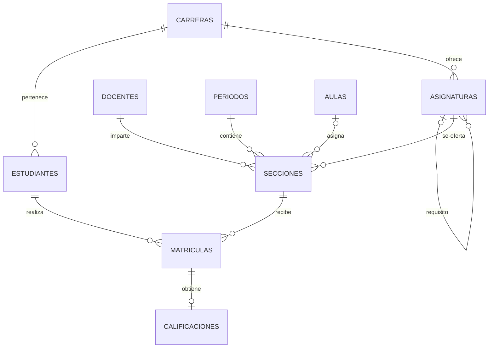

# Modelo relacional

## Tipos de relación

| Relación | Tipo | Implementación |
|---|---|---|
| Carrera–estudiante | Uno a muchos | `estudiantes.carrera_id` |
| Carrera–asignatura | Uno a muchos | `asignaturas.carrera_id` |
| Asignatura–requisito | Autorrelación opcional | `asignaturas.requisito_id` |
| Asignatura–sección | Uno a muchos | `secciones.asignatura_id` |
| Docente–sección | Uno a muchos | `secciones.docente_id` |
| Período–sección | Uno a muchos | `secciones.periodo_id` |
| Aula–sección | Uno a muchos opcional | `secciones.aula_id` |
| Estudiante–sección | Muchos a muchos | Tabla intermedia `matriculas` |
| Matrícula–calificación | Uno a uno opcional | `calificaciones.matricula_id UNIQUE` |

`ON DELETE RESTRICT` protege el historial. `ON DELETE SET NULL` permite retirar
un aula o requisito sin borrar la sección o asignatura relacionada. `ON DELETE
CASCADE` elimina la calificación cuando se elimina deliberadamente su matrícula.

